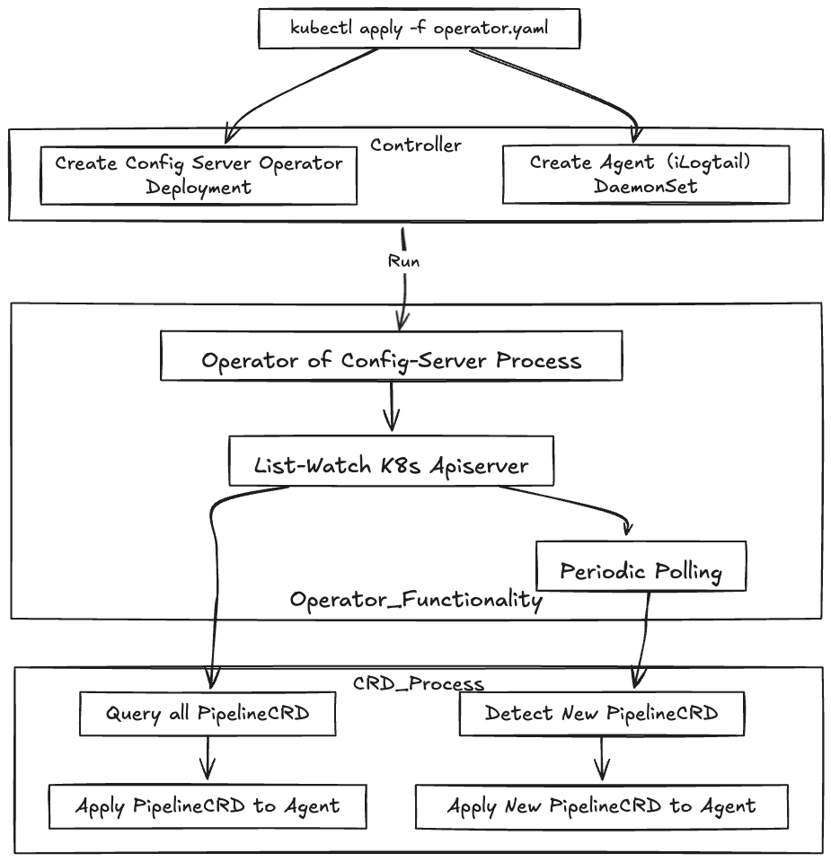

# Kubernetes Operator for LoongCollector

LoongCollector Operator 用于管理和交付具有 Config-Server 集成的 LoongCollector Pipelines

## 架构



## 功能特性

- 支持通过 Kubernetes CRD 管理 LoongCollector Pipeline 配置
- 自动将 Pipeline 配置同步到 LoongCollector Config-Server
- 支持配置验证和错误处理
- 支持配置重试机制
- 支持优雅删除和资源清理
- 支持通过 ConfigMap 配置 Config-Server 地址

## 安装

### 前提条件

- Kubernetes 集群 1.16+
- LoongCollector 已部署并运行
  - LoongCollector 部署请参考 [LoongCollector 部署文档](https://ilogtail.gitbook.io/ilogtail-docs/installation/start-with-k8s)，也可也可在kubernetes集群中[快速部署](config/samples/loongcollector.yaml)
- Config-Server 已部署并运行

  - Config-Server 部署请参考 [Config-Server 部署文档](https://github.com/iLogtail/ConfigServer)，也可在kubernetes集群中[快速部署](config/samples/config-server/config-server.yaml)

### 快速开始

- 安装 Operator
```bash
kubectl apply -f https://github.com/infraflows/loongcollector-operator/blob/main/dist/install.yaml
```

- 部署 Config-Server（可选）：

```bash
kubectl apply -f https://github.com/infraflows/loongcollector-operator/blob/main/config/samples/infraflow_v1alpha1_pipeline.yaml
```

- 部署 LoongCollector（可选）：

```bash
kubectl apply -f https://github.com/infraflows/loongcollector-operator/blob/main/config/samples/loongcollector.yaml
```

## 使用

- 创建 Pipeline

```yaml
cat <<EOF | kubectl apply -f -
apiVersion: infraflow.co/v1alpha1
kind: Pipeline
metadata:
  name: sample-pipeline
spec:
  name: sample-pipeline
  content: |
    tags:
      - default
    inputs:
      - type: file
        path: /var/log/containers/*.log
    processors:
      - type: json
        fields:
          - message
    outputs:
      - type: stdout
EOF

kubectl apply -f pipeline.yaml
```
或者使用以下命令：
```bash
kubectl apply -f https://github.com/infraflows/loongcollector-operator/blob/main/config/samples/infraflow_v1alpha1_pipeline.yaml
```

- 创建 AgentGroup

```bash
kubectl apply -f https://github.com/infraflows/loongcollector-operator/blob/main/config/samples/agentgroup.yaml
```

### 配置说明

#### Pipeline CRD

Pipeline CRD 字段说明：

- `spec.name`: Pipeline 名称
- `spec.content`: Pipeline 配置（YAML 格式）

更多 Pipeline CRD 字段说明请参考 [Pipeline CRD 文档](docs/pipeline-fields.md)
#### Config-Server 配置

默认情况下，Config-Server 服务地址是 `http://config-server:8899` ，也可以通过 ConfigMap 配置 Config-Server 地址：

```yaml
apiVersion: v1alpha1
kind: ConfigMap
metadata:
  name: config-server-config
  namespace: loongcollector-system
  labels:
    app: config-server
data:
  configServerURL: "http://config-server:8899"
```
> Tips：
>- operator获取Config-Server优先级为 **默认地址 `http://config-server:8899`** > **ConfigMap**，获取ConfigMap的方式是通过lable获取，值为`app: config-server`，暂不支持修改
>- 如果Config-Server地址发生变化，需要手动更新ConfigMap，并重启operator
>   - `kubectl rollout restart deployment -n loongcollector-system loongcollector-operator` 重启operator

## 开发

### 本地开发

1. 安装依赖：

```bash
go mod tidy
```

2. 运行测试：

```bash
make test
```

3. 构建镜像：

```bash
make docker-build
```

4. 生成安装文件：

```bash
make build-installer
```

## 许可证

[Apache License 2.0](LICENSE)